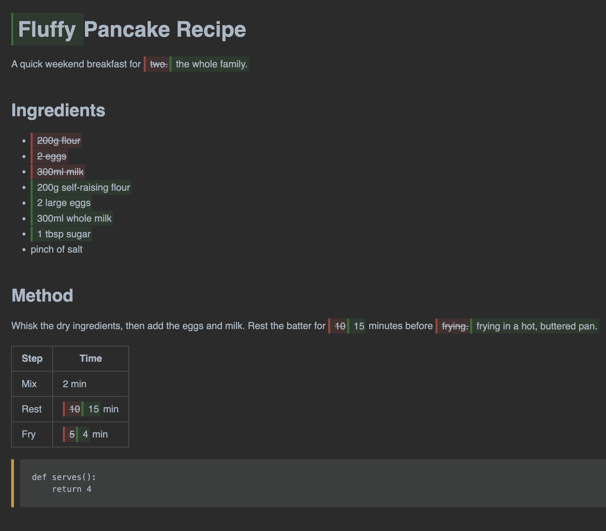
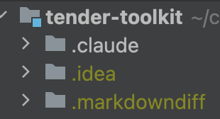

# markdowndiff

Generate rendered-markdown diff files for visual review in IDE markdown previews (IntelliJ, VS Code, Obsidian, …).

For each changed `.md` file, `markdowndiff` writes a sibling file under `.markdowndiff/<same relative path>.md` where additions are wrapped in `<ins>` and deletions in `<del>`. Because markdown allows inline HTML and most IDE previews render inline styles, the preview shows the formatted markdown with colored highlights for changes — a *rendered* diff, not raw diff markers.

Pairs nicely with [Claude Code](https://claude.com/claude-code): wire it up as a `Stop` hook and every time Claude finishes editing your docs, the rendered diff is one click away.

## Example




A short before/after recipe rendered through `markdowndiff` — heading and paragraph edits get word-level inline highlights, list and table changes show only the cells that actually moved, and a wholly-modified code fence gets the amber side-border.

## Requirements

- Python 3.9+
- `git` on PATH

No third-party dependencies. Standard library only.

## Install

With [pipx](https://pipx.pypa.io/) (recommended — installs into an isolated env, command available globally):

```bash
pipx install git+https://github.com/cognizone/markdowndiff.git
```

Or install from a local clone:

```bash
pipx install /path/to/markdowndiff
```

To upgrade later:

```bash
pipx upgrade markdowndiff
```

## Usage

From any git repo root:

```bash
markdowndiff                         # auto-detect: uncommitted on trunk, whole-branch elsewhere
markdowndiff --branch                # force: vs merge-base with <trunk>
markdowndiff --base main             # force: vs specific ref
markdowndiff --base HEAD~3           # vs any ref
markdowndiff path/to/*.md            # limit to pathspecs
markdowndiff --help                  # all options
```

Options:

- `--base REF` — compare working tree against this git ref. Overrides auto-detect.
- `--branch` — force merge-base with `<trunk>`. Overrides `--base` and auto-detect.
- `--trunk TRUNK` — trunk branch used by `--branch` and auto-detect (default: `main`).
- `--output DIR` — output directory relative to repo root (default: `.markdowndiff`).
- `--set-mode {uncommitted,branch,auto}` — persist a default mode in `<output>/.mode` (see "Persisting a mode override" below) and exit. `auto` clears the override.
- `--show-mode` — print the persisted mode (`auto` if no override) and exit.
- `-q, --quiet` — suppress per-file progress and the summary line (errors still print).
- `-v, --verbose` — also list each stale file that cleanup removed.
- `PATHS...` — optional pathspecs to limit processing.

**Auto-detect** picks the most useful default based on your current branch:

- On trunk (`main`) → uncommitted changes (vs HEAD).
- On any other branch → whole-branch diff (vs merge-base with trunk).

### Persisting a mode override

If you want a specific mode to stick across invocations (including hook-triggered runs), write it once:

```bash
markdowndiff --set-mode uncommitted   # always vs HEAD, even on branches
markdowndiff --set-mode branch        # always vs merge-base with trunk
markdowndiff --set-mode auto          # clear the override
```

The setting is stored in `.markdowndiff/.mode` (gitignored, per-checkout). Explicit `--base` / `--branch` on a given invocation still override it.

Precedence, from highest to lowest:

1. Explicit `--base REF` or `--branch` on the command line.
2. `.markdowndiff/.mode` if present.
3. Auto-detect based on current branch vs `--trunk`.

## Output

Writes to `<output>/<same-relative-path>.md` for each changed `.md`. Directory structure mirrors the source.

Style conventions in the generated files:

- **Added content** — subtle green tint with a darker green left-border, no text-decoration change.
- **Removed content** — subtle red tint with a darker red left-border, plus strikethrough.
- **Wholly-added code blocks** — wrapped in a green left-border `<div>` around the fence; content renders as normal code.
- **Wholly-removed code blocks** — wrapped in a red left-border `<div>`.
- **Modified code blocks** — wrapped in an amber left-border `<div>` (insert/delete *inside* a kept fence).
- **Unchanged content** — passes through verbatim.

Colors use `rgba` with low alpha so they work in both light and dark IDE themes; the IDE's native text color shows through.

### Cleanup of stale files

After a default run the script deletes any `.md` file under the output directory that wasn't written this run, and removes now-empty subdirectories. This keeps `.markdowndiff/` in sync with the current changeset — a file that was changed earlier but is now reverted or committed stops lingering as a stale artifact.

Cleanup is **skipped** when you pass pathspecs — partial runs shouldn't wipe files outside the filter. Hidden files (like `.mode`) and non-`.md` files are always preserved regardless of mode.

## Opening the output



In IntelliJ (or any JetBrains IDE): open any file under `.markdowndiff/`, right-click → "Open Preview" (or `⌘⇧A` → "Markdown Preview"). Inline HTML styles render natively.

Other editors: anything with a markdown preview that respects inline HTML (VS Code's built-in preview, Obsidian, etc.) should work. GitHub's web preview strips style attributes for security, so it won't render the colors.

## Claude Code integration

Add a `Stop` hook so `.markdowndiff/` refreshes every time Claude Code finishes a turn that touched markdown. In `.claude/settings.json` at the repo root:

```json
{
  "hooks": {
    "Stop": [
      {
        "hooks": [
          {
            "type": "command",
            "command": "cd \"$CLAUDE_PROJECT_DIR\" && git status --porcelain '*.md' | grep -q . && markdowndiff >/dev/null 2>&1 || true",
            "statusMessage": "Refreshing .markdowndiff/"
          }
        ]
      }
    ]
  }
}
```

The `git status --porcelain '*.md' | grep -q .` guard short-circuits the hook when nothing markdown changed, so most turns pay no cost. The trailing `|| true` keeps a non-zero exit (e.g. you're not in a git repo at all) from blocking the turn.

You'll usually also want to gitignore the output:

```gitignore
.markdowndiff/
```

## Behavioural notes

- **Line-level diff first** via `difflib.SequenceMatcher`, preserving markdown block structure.
- **Inline word-level diff** inside single-line replacements where similarity ≥ 0.6, so small edits highlight individual words rather than entire lines. Skipped on lines containing backticks to avoid HTML-in-code-span issues.
- **Block-level markers** (headings, list items, blockquotes, table rows) wrap content after the marker so markdown block recognition survives. E.g., `## Title` becomes `## <ins>Title</ins>`.
- **Fenced code blocks** pass through unwrapped so the fence renders; wholly-added/removed/modified blocks get a colored border `<div>` around them. Changes *inside* an existing code block are not highlighted per-line (the fence would break).

## Known limitations

- Changes *within* an existing fenced code block aren't highlighted per-line — only the whole block gets an amber border.
- Table cells with escaped pipes (`\|`) or pipes inside inline code may mis-split.
- Renamed files are reported as delete-old + add-new.
- A whole-file deletion shows content verbatim wrapped in `<del>`; the fence inside a fully-deleted block doesn't render as code.

## Development

Clone and run the tests with stdlib `unittest` — no third-party deps:

```bash
git clone https://github.com/cognizone/markdowndiff.git
cd markdowndiff
python3 -m unittest discover tests
```

Or run the test file directly:

```bash
python3 tests/test_markdowndiff.py
```

For an editable install during development:

```bash
pip install -e .
```

### Project layout

```
src/markdowndiff/
  __init__.py    diff engine (`diff_to_markdown`) and fence-region helpers; re-exports the public API
  __main__.py    `python3 -m markdowndiff` entry point
  cli.py         argparse, `main`, `resolve_base`
  git_ops.py     git subprocess wrappers + content readers
  processing.py  per-file diff generation (`process_file`) and stale-output cleanup (`cleanup_stale`)
  styles.py      HTML/CSS constants (`INS_STYLE`, `DEL_STYLE`, block-border styles, `GENERATED_HEADER`)
  wrap.py        tokenization, `wrap_ins`/`wrap_del`, table-aware and prefix-aware line wrappers
  word_diff.py   `should_word_diff`, `inline_word_diff` for similar single-line replacements
```

Dependency direction (each module imports only from those listed beneath it):

```
__main__   →  cli
cli        →  __init__ (`__version__`), git_ops, processing
processing →  __init__ (`diff_to_markdown`), git_ops, styles
__init__   →  styles, wrap, word_diff, git_ops    (top-of-file re-exports)
                                                   plus processing + cli (bottom-of-file re-exports)
word_diff  →  wrap
wrap       →  styles
styles     →  (leaf — stdlib only)
git_ops    →  (leaf — stdlib only)
```

`__init__.py` re-exports leaf-module names at the top of the file and re-exports `processing` + `cli` names at the bottom. The bottom-of-file pattern lets those submodules import engine names (`diff_to_markdown`) from the package root without a circular-import error: by the time the bottom imports run, every top-level name in `__init__.py` is already defined.

### Public API

```python
from markdowndiff import __version__, diff_to_markdown
```

The stable, supported package surface is the three names listed in
`__init__.py`'s `__all__`:

| Name              | What it is                                   |
| ----------------- | -------------------------------------------- |
| `__version__`     | Package version string.                      |
| `diff_to_markdown(old: str, new: str) -> str` | Core diff function: takes the old and new contents of a markdown file as strings, returns the merged markdown with `<ins>`/`<del>` tags. |
| `main()`          | CLI entry point used by the installed `markdowndiff` script. |

All other names reachable from the `markdowndiff` module root (helpers like `wrap_ins`, `split_block_prefix`, `process_file`, fence-region utilities, etc.) are **internal** — they exist for tests and for cross-module use within the package, and may be renamed, moved, or removed without a major version bump. Library users should import only from the public surface above; if you have a use case for a currently-internal helper, open an issue and we can promote it.

Fixtures cover the helper functions plus end-to-end `diff_to_markdown` scenarios including table edits, code-fence modifications (added/removed/modified), and the regressions shipped during the tool's early iterations. Extend the suite when adding behaviour so the existing scenarios stay locked down.

## License

Apache 2.0 — see [LICENSE](LICENSE).
